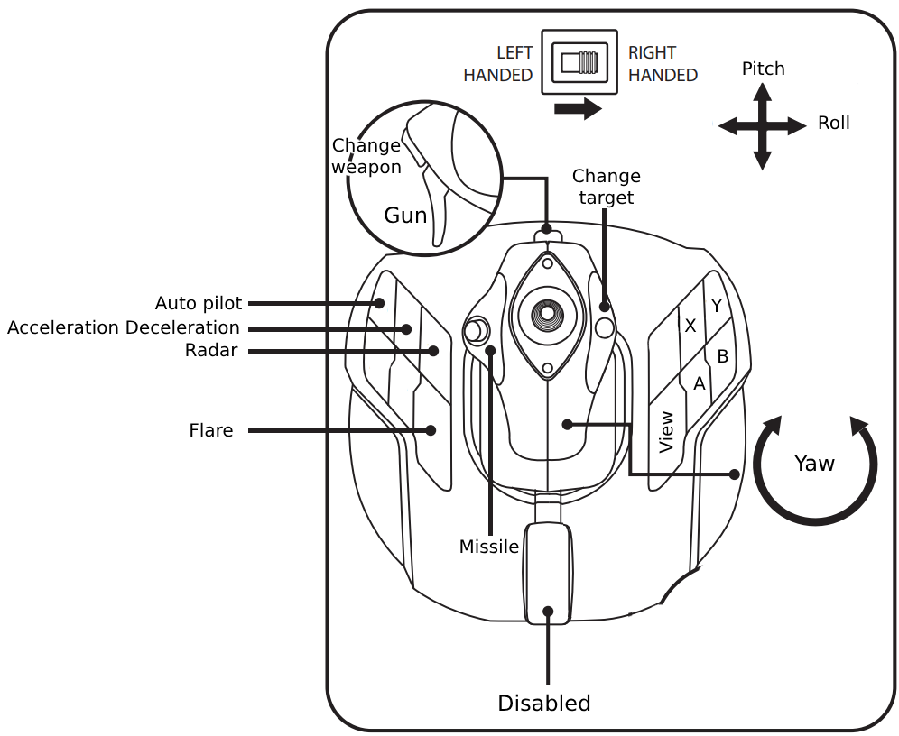
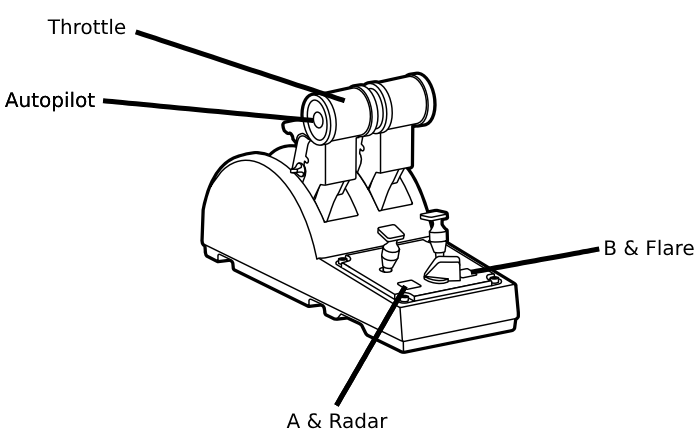

# Ace Combat™ 7: Skies Unknown configuration file for Thrustmaster T.A320 Copilot and Thrustmaster TCA Q-Eng 1&2 joysticks

Copy the file `Config/Input.ini` into `C:\Users\[YourUsername]\AppData\Local\BANDAI NAMCO Entertainment\ACE COMBAT 7\Config`.

# Layout

## Notes
1. If you don't have a Thrustmaster TCA Q-Eng 1&2 joystick, remove the `ProductName=TCA Q-Eng 1&2` section and set
`Flight_Throttle=Slider1` on the `ProductName=T.A320 Copilot` section
2. You can use the Hat Switch buttons to navigate over the game menus

# Troublesooting
In case of errors a `Config/Input.ini.original` file is provided with the original content (based on Thrustmaster T.A320 Copilot and TCA Q-Eng 1&2 joysticks).

